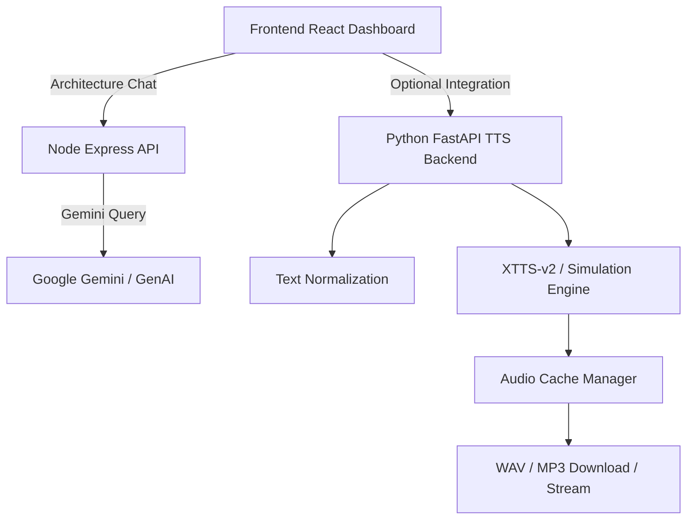

# SpeechCraft — Multilingual Offline TTS System

> A full-stack internship-grade proof-of-concept demonstrating multilingual expressive speech synthesis, offline-capable model readiness, voice cloning, language-specific normalization, caching, and architecture-level AI assistant support.

---

## What This Repository Contains

- **Frontend UI:** React + Vite + Tailwind-powered dashboard with an interactive TTS playground, model comparison matrix, pipeline inspector, and linguistic optimizer.
- **Node backend:** `server.ts` runs an Express server for the React frontend and exposes `/api/query-architecture` that forwards engineering queries to Google Gemini via `@google/genai`.
- **Python TTS backend blueprint:** `backend/main.py` implements a FastAPI service for offline text-to-speech, caching, streaming, voice cloning, and language normalization.
- **Multilingual normalization:** `backend/normalizer` contains English, Hindi, Kannada, and Telugu text normalization pipelines.
- **Caching / telemetry:** Local disk + in-memory audio cache, health diagnostics, and structured log file output.

---

## Key Features

### Frontend

- Interactive **TTS Playground** with:
  - configurable language selection: `en`, `hi`, `kn`, `te`
  - speaker preset selection and voice cloning upload simulation
  - speed / pitch controls
  - synthesis stage simulation (normalization, G2P, acoustic, vocoder)
  - client-side waveform generation and downloadable WAV blob
- **AI Architecture Assistant:** Chat interface that sends prompts to `/api/query-architecture` and displays Gemini responses.
- **Model Comparison Grid:** Analysis of open-source TTS families like Piper, Coqui XTTS-v2, VITS, and Bark.
- **Pipeline Architecture Visualizer:** Node-based pipeline explorer showing stages from text normalization through waveform output.
- **Linguistic optimizer view:** Dravidian phonetics rules for Kannada, Telugu, Hindi and how they affect TTS pronunciation.
- **Offline blueprints:** Code inspector that exposes runnable backend snippets, batch deployment scripts, and local setup guidance.

### Backend (Node)

- Express server in `server.ts`
- Dev-mode integration with Vite middleware
- Production mode static asset serving from `dist`
- Gemini-based assistant endpoint:
  - `POST /api/query-architecture`
  - accepts `message` and `history`
  - uses `GEMINI_API_KEY`

### Python Backend (FastAPI)

- Modular offline TTS service in `backend/main.py`
- Endpoints:
  - `GET /api/health`
  - `POST /api/tts/synthesize`
  - `POST /api/tts/synthesize/batch`
  - `GET /api/tts/download/{cache_key}`
  - `GET /api/tts/stream`
  - `POST /api/voices/clone`
  - `POST /api/cache/clear`
- **Offline simulation mode:** If XTTS model files are missing, backend still returns synthetic waveform fallback audio.
- **Voice cloning readiness:** accepts WAV uploads, stores reference samples under `VOICEOVER_DIR`, and caches speaker embeddings.
- **Parallel synthesis:** batch processing and async thread offloading using `asyncio.to_thread`.

### Language and NLP Components

- `backend/normalizer` includes:
  - English normalization rules (dates, numbers, currencies, URLs, emails)
  - Hindi text normalization with Devanagari numeral conversion
  - Kannada normalization with regional digit mapping and pronunciation-safe number expansion
  - Telugu normalization with script-aware handling and voice-friendly text expansion
- Real text normalization is used before synthesis in `backend/tts_engine.py`.

### Caching and Monitoring

- `backend/cache_manager.py` implements:
  - disk-based audio cache under `CACHE_DIR`
  - hot in-memory audio bytes cache
  - file size enforcement and LRU-style eviction
- `backend/logger.py` provides:
  - stdout structured logging
  - rotating file logs stored in `logs/app.log`
- `GET /api/health` returns:
  - app version and uptime hints
  - model load state
  - supported languages
  - cache metrics
  - offline simulation status

### XTTS / Voice Cloning Readiness

- `backend/tts_engine.py` supports Coqui **XTTS-v2**:
  - `XTTSv2Engine.load_model()` loads model weights if `MODEL_DIR` contains model files
  - supports `cuda` and `cpu` with optional FP16 when available
  - fallback to synthetic offline waveform generation when model assets are absent
  - speaker embedding extraction and caching for faster repeat cloning
- `backend/audio_processor.py` can convert WAV to MP3 using `pydub`; if unavailable, it falls back to simulated MP3 wrapper.

---

## Architecture Overview



> Notes: The frontend UI demonstrates both the Node-based architecture assistant and a separate Python offline TTS backend blueprint. Some playback and cloning flows are currently implemented as simulation or prototype behavior in the browser.

---

## Project Structure

- `server.ts` — Node Express app, frontend middleware integration, Gemini query endpoint.
- `src/` — React frontend application.
  - `App.tsx` — main tabbed dashboard.
  - `components/` — UI views for playground, architecture, linguistics, model comparison, and offline blueprints.
  - `data.ts` — model comparisons and architecture data driving the UI.
- `backend/` — FastAPI-based TTS service blueprint.
  - `main.py` — API routes and application lifecycle.
  - `config.py` — environment-driven deployment settings.
  - `logger.py` — structured logging with file rotation.
  - `cache_manager.py` — audio result caching layer.
  - `tts_engine.py` — Coqui XTTS-v2 wrapper and simulation fallback engine.
  - `audio_processor.py` — audio transcoding utilities.
  - `normalizer/` — multilingual text normalization pipelines.

---

## Setup Instructions

### 1. Node frontend + Gemini assistant

```bash
cd path/to/Vani.AI-main
npm install
```

Create a `.env` file in the repo root with:

```env
GEMINI_API_KEY=your_gemini_api_key_here
NODE_ENV=development
```

Run in development mode:

```bash
npm run dev
```

Build for production:

```bash
npm run build
npm start
```

### 2. Python FastAPI backend

```bash
cd path/to/Vani.AI-main
python -m venv env
./env/Scripts/activate
pip install -r backend/requirements.txt
```

Start the service:

```bash
uvicorn backend.main:api_app --host 0.0.0.0 --port 8000 --reload
```

### 3. Optional XTTS model preparation

Ensure offline model files exist in `backend/models` and configure `.env` as needed:

```env
MODEL_DIR=./backend/models
XTTS_MODEL_NAME=tts_models/multilingual/multi-dataset/xtts_v2
TTS_DEVICE=cuda
USE_FP16=True
```

If model files are missing, the backend enters an **offline simulation mode** and still provides synthetic audio for testing.

---

## API Reference

### Node assistant endpoint

- `POST /api/query-architecture`
  - request body: `{ message, history }`
  - returns Gemini assistant response

### Python TTS backend endpoints

- `GET /api/health`
- `POST /api/tts/synthesize`
  - body: `{ text, language, speaker_name, speed, pitch, output_format }`
- `POST /api/tts/synthesize/batch`
  - body: `{ texts, language, speaker_name, speed, pitch, output_format }`
- `GET /api/tts/download/{cache_key}?format=wav|mp3`
- `GET /api/tts/stream?text=...&language=...&speaker_name=...&speed=...&pitch=...&format=...`
- `POST /api/voices/clone`
  - form fields: `speaker_name`, `file` (WAV upload)
- `POST /api/cache/clear`

---

## Deployment Notes

- The app is designed for local Windows-compatible deployment.
- `server.ts` is the Node entrypoint for the frontend and Gemini assistant.
- `backend/main.py` is a separate service for offline TTS inference and streaming.
- Use `.env` or system environment variables for credentials and device configuration.
- The Python backend logs to `logs/app.log` and maintains local audio cache in `./audio_cache`.

---

## Future Scope

- Add direct frontend integration between React UI and the Python FastAPI TTS backend.
- Expand the voice cloning UI to upload and enroll real WAV references to the backend.
- Add Windows installer scripts and batch automation for model download + environment setup.
- Replace simulated front-end audio generation with genuine backend inference calls.
- Add security, authentication, rate limiting, and production-grade deployment manifests.
- Extend normalization and G2P rules to support additional Indian languages and transliteration systems.

---

## Notes for Technical Reviewers

- The repository combines a modern React/Vite UI with both Node and Python backend patterns.
- It demonstrates architecture-level thinking: API gateway, model readiness detection, cache management, and telemetry.
- The Python backend is designed to run offline and fall back to synthetic output when model assets are unavailable, preserving a complete end-to-end experience.
- The project is ideal for portfolio showcase, placement interviews, and academic evaluation because it documents both the implementation and the engineering trade-offs.

---

## Screenshot Placeholders


---

## License

This repository does not include a formal license file. Add one if you plan to publish or share it publicly.
