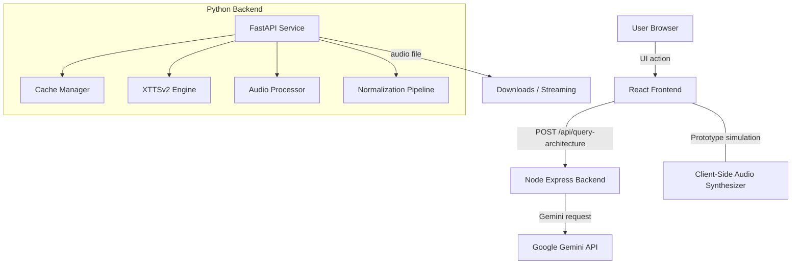

# Technical Working Document

## 1. Overview

`Vani.AI` is a hybrid full-stack project combining:

- A React + Vite frontend user interface for exploring speech synthesis features.
- A Node.js Express server for static frontend delivery and an AI architecture assistant endpoint.
- A separate Python FastAPI backend blueprint that implements offline-capable TTS inference, caching, monitoring, and voice cloning readiness.

This document explains the actual code paths and internal design implemented in the repository.

---

## 2. Complete Architecture

### 2.1 Architecture Summary

The repository implements two primary backends:

1. `server.ts` — Node/Express middleware for the React app and AI assistant routing.
2. `backend/main.py` — Python FastAPI service for offline TTS, audio cache, streaming, voice enrollment, and telemetry.

The frontend connects to the Node backend for architecture assistant queries. The Python backend is architected as a separate service and can run independently.

### 2.2 Architecture Components

- `server.ts`
  - Express server hosting the SPA in development using Vite middleware.
  - Static file server for production from `dist/`.
  - API endpoint `/api/query-architecture` that forwards requests to Google Gemini via `@google/genai`.
- `src/` frontend
  - `App.tsx` orchestrates the UI, tabs, and feature views.
  - `components/` contains interactive screens for TTS simulation, model comparisons, architecture visualizations, linguistics, offline blueprints, and AI assistant chat.
- `backend/` Python service
  - `main.py` exposes all offline audio service APIs.
  - `config.py` centralizes environment-driven configuration.
  - `logger.py` configures structured logging and file rotation.
  - `cache_manager.py` manages disk and memory caches for audio.
  - `tts_engine.py` integrates XTTS-v2 readiness and fallback waveform generation.
  - `audio_processor.py` handles WAV-to-MP3 conversion.
  - `normalizer/` contains multilingual text normalization logic.

### 2.3 High-Level Flow

---

## 3. Frontend Workflow

### 3.1 Entry point

- `src/main.tsx` mounts the React app.
- `App.tsx` provides the primary tabbed dashboard and state management.

### 3.2 User interactions

The main front-end flows are:

- **TTS Playground** (`TtsPlayground.tsx`)
  - Accepts raw text, language selection, speaker preset, speed, pitch, and emotion.
  - Supports voice-clone file upload simulation.
  - Simulates a five-stage synthesis pipeline: normalization, G2P, acoustic, vocoder, ready.
  - Generates a client-side WAV blob from a synthetic waveform algorithm and exposes a download link.

- **AI Assistant** (`AiAssistant.tsx`)
  - Sends architecture questions to `/api/query-architecture`.
  - Displays assistant conversation history.
  - Supports prompt suggestions and handles API errors.

- **Model Comparison** (`ModelComparisonTable.tsx`)
  - Shows data-driven comparison between TTS architectures.
  - Has no live backend dependency.

- **Architecture Graph** (`ArchitectureGraph.tsx`)
  - Interactive diagram with pipeline stages and node details.
  - Exposes conceptual design rather than actual runtime instrumentation.

- **Linguistic Optimizer** (`LinguisticOptimizerView.tsx`)
  - Demonstrates Dravidian linguistic rules using preset examples.
  - Custom word parser is heuristic-based for demonstration.

- **Offline Blueprints** (`OfflineBlueprints.tsx`)
  - Offers code snippets and downloadable simulated deployment scripts.
  - Does not invoke any actual backend TTS endpoint.

### 3.3 Frontend data flow

- UI state is maintained through React `useState` hooks.
- Audio generation in the playground is local, using browser APIs and a synthetic waveform algorithm.
- Only one backend interaction exists from the frontend: the AI assistant chat.

---

## 4. Backend Workflow

This project has two backend layers.

### 4.1 Node backend workflow (`server.ts`)

- Express app initializes and reads environment variables via `dotenv`.
- On startup:
  - `app.use(express.json())`
  - Lazy initialization of the Gemini client.
- Endpoint `POST /api/query-architecture`:
  - Validates `message` and optional `history`.
  - Builds a `systemInstruction` prompt for the Gemini model.
  - Sends a request to `ai.models.generateContent(...)`.
  - Returns the generated text or an error payload.

- Development mode uses Vite middleware for live reload.
- Production mode serves compiled assets from `dist/`.
- The Node backend is not directly tied to the Python TTS backend in this repository.

### 4.2 Python backend workflow (`backend/main.py`)

- FastAPI app is initialized with CORS enabled for all origins.
- Startup event launches a background thread to pre-load TTS weights via `tts_engine.load_model()`.
- Error handling uses a global exception handler that logs and returns 500 errors.

- Request lifecycle for `/api/tts/synthesize`:
  1. Validate request payload and supported language.
  2. Normalize output format.
  3. Generate a cache key using text, language, speaker, speed, pitch, and format.
  4. Attempt in-memory cache lookup.
  5. If cache miss, optionally locate a speaker reference WAV.
  6. Call `tts_engine.synthesize_wav_data(...)` in a worker thread.
  7. Optional MP3 conversion.
  8. Save bytes to cache and return download metadata.

- `/api/tts/synthesize/batch` runs many syntheses in parallel via `asyncio.gather`.
- `/api/tts/download/{cache_key}` serves cached files.
- `/api/tts/stream` returns a `StreamingResponse` yielding 8KB chunks.
- `/api/voices/clone` uploads a WAV sample, stores it, and registers speaker embeddings.
- `/api/cache/clear` purges disk and memory caches.

### 4.3 Backend session and startup

- `config.py` loads all environment options including device selection, cache limits, model paths, and supported languages.
- The Python backend relies on `settings` from `config.py` for runtime behavior.
- `tts_engine.load_model()` is attempted asynchronously on startup but may silently transition to simulation mode if assets are missing.

---

## 5. API Communication Flow

### 5.1 Frontend-to-Node backend

- Only the AI assistant uses this communication path.
- Call: `POST /api/query-architecture`
- Payload: `{ message, history }`
- Response: `{ response }` or `{ error }`
- The Node backend forwards requests to Gemini with a hard-coded engineering persona.

### 5.2 Node backend-to-Gemini

- Uses `@google/genai` client from `server.ts`.
- The Gemini client is lazily initialized on first request.
- Request is sent with `model: "gemini-3.5-flash"`, `temperature: 0.7`, and the constructed system prompt.

### 5.3 Python backend internal API flow

- The Python backend provides a REST API surface for offline audio synthesis.
- No frontend component in this repository actually consumes these endpoints.
- The backend routes are self-documenting through their FastAPI route definitions.

### 5.4 Data contracts

- `SynthesisRequest` and `BatchSynthesisRequest` use Pydantic validation.
- `SynthesisResponse` includes cache metadata, duration approximations, and download URLs.

---

## 6. NLP Normalization Pipeline

### 6.1 Normalizer architecture

- `backend/normalizer/__init__.py` selects the appropriate normalizer for language codes `en`, `hi`, `kn`, and `te`.
- A `BaseNormalizer` implements shared regex and cleaning steps.
- Language-specific normalizers extend `BaseNormalizer` and override rules for URLs, emails, phone numbers, percentages, currencies, dates, and times.

### 6.2 Pipeline steps

Shared pipeline order in `BaseNormalizer.normalize()`:

1. `clean_repeated_punctuation`
2. `normalize_emails`
3. `normalize_urls`
4. `normalize_phones`
5. `normalize_currencies`
6. `normalize_percentages`
7. `normalize_dates`
8. `normalize_times`
9. `expand_abbreviations`
10. `expand_numbers`
11. `clean_noise_characters`

### 6.3 Language-specific behavior

- **English**
  - converts numeric strings into words
  - expands currency formats and percentages
  - normalizes URLs and emails with spoken tokens
- **Hindi**
  - converts Devanagari digits to Arabic digits
  - translates numbers with Indian numbering terminology
  - produces Hindi script expansions for URLs and email tokens
- **Kannada**
  - cleans Kannada numerals and translates numbers into Kannada words
  - includes locale-specific currency naming
- **Telugu**
  - cleans Telugu numerals and translates numbers into Telugu words
  - uses Telugu-specific tokens for URLs and email normalization

### 6.4 Integration point

- `backend/tts_engine.py` imports `normalize_text` from `backend/normalizer`.
- Normalization is applied prior to all audio synthesis calls.

---

## 7. Voice Cloning Pipeline

### 7.1 Endpoint support

- `/api/voices/clone` accepts `speaker_name` and a `file` upload.
- Validation enforces safe characters and `.wav` file extension.
- The uploaded voice sample is stored under `settings.VOICEOVER_DIR`.

### 7.2 Embedding generation

- After saving the WAV, the endpoint calls `tts_engine.get_speaker_embedding(destination_file)`.
- This method attempts to extract speaker vectors from the XTTS-v2 model.
- If the model is not loaded, it returns dummy random vectors for simulation.

### 7.3 Speaker reference usage

- `/api/tts/synthesize` will optionally locate a speaker reference file when `speaker_name != "default"`.
- If found, the reference WAV is passed to `tts_engine.synthesize_wav_data(...)`.
- The engine caches extracted embeddings in `_speaker_embeddings_cache`.

### 7.4 Limitations

- The frontend currently only simulates a voice cloning upload; it does not actually call `/api/voices/clone`.
- There is no client-side flow to fetch registered speaker lists or manage enrolled voices.

---

## 8. Audio Generation Pipeline

### 8.1 Core synthesis flow

Implemented in `backend/tts_engine.py`.

1. Validate the requested language.
2. Normalize the raw text.
3. Attempt to load the XTTS-v2 model if not already loaded.
4. If loaded, prepare speaker embeddings and synthesize using `self.model.synthesize(...)`.
5. Convert the returned waveform to 16-bit PCM WAV using `scipy.io.wavfile`.
6. If the model is unavailable, run `_synthesize_offline_demowav()`.

### 8.2 XTTS-v2 readiness

- The engine reads `config.json` from `settings.MODEL_DIR`.
- It imports Coqui XTTS classes dynamically inside the load routine.
- Device selection is controlled by `TTS_DEVICE` and `USE_FP16`.
- If `settings.DEVICE == "cuda"` and CUDA is available, it attempts FP16 execution.

### 8.3 Fallback synthesis

- In simulation mode, `_synthesize_offline_demowav()` generates a synthetic WAV waveform.
- It creates a single-channel waveform with envelope shaping and pitch/harmonic approximations.
- This ensures the service remains functional even without model assets.

### 8.4 MP3 conversion

- `backend/audio_processor.py` uses `pydub.AudioSegment` if available.
- If `pydub` or `ffmpeg` is missing, the code uses `_pure_python_mp3_fallback()` to wrap WAV payload bytes with a minimal MPEG header.

### 8.5 Streamed audio delivery

- `/api/tts/stream` synthesizes audio, then yields it in 8KB chunks.
- The route uses `asyncio.to_thread` to keep the event loop responsive.

---

## 9. Caching Strategy

### 9.1 Cache design

`backend/cache_manager.py` implements a two-tier cache:

- **Memory cache**
  - `self._memory_cache` stores hot audio bytes.
  - Limited by `settings.MEM_CACHE_MAX_ITEMS`.
  - Evicts oldest entries when full.
- **Disk cache**
  - Files persisted under `settings.CACHE_DIR`.
  - Named by stable MD5 hashes of normalized text and synthesis parameters.

### 9.2 Cache keys

Cache keys are generated from:

- normalized text
- language
- speaker name
- speed
- pitch
- format

This ensures identical requests reuse the same synthesized asset.

### 9.3 Cache retrieval and promotion

- `get_cached_bytes()` checks memory cache first.
- If the file is on disk, it reads it and promotes it into the memory cache if capacity allows.

### 9.4 Disk limit enforcement

- `_enforce_size_limit()` computes current cache size.
- If limits are exceeded, it deletes oldest files until usage drops below 80% of the configured max.

### 9.5 Cache invalidation

- `clear_cache_route()` triggers `cache_manager.clear_cache()`.
- This clears both the on-disk files and the in-memory cache.

---

## 10. Telemetry System

### 10.1 Logging

- `backend/logger.py` configures a `RotatingFileHandler`.
- Log format includes timestamps, severity, module, filename, and line number.
- Logs are written to `logs/app.log`.

### 10.2 Information captured

- Request lifecycle events in `main.py`
- Cache hits, misses, and eviction decisions in `cache_manager.py`
- Model load decisions and performance tuning in `tts_engine.py`
- Audio conversion success/failure in `audio_processor.py`
- Error traces in the global FastAPI exception handler

### 10.3 What is not implemented

- There is no external telemetry service, metrics exporter, or APM integration.
- There is no per-request tracing, distributed tracing, or request ID propagation beyond standard logs.

---

## 11. Monitoring System

### 11.1 Health check endpoint

- `GET /api/health` returns:
  - `status`
  - `app_name`, `version`
  - whether the model is loaded
  - device selection and offline simulation mode flag
  - cache usage and file count
  - supported languages
  - local epoch timestamp

### 11.2 Observability

- The monitoring model is limited to this single endpoint and log file analysis.
- There is no integrated metrics dashboard or alerting.

---

## 12. Simulation Mode Architecture

### 12.1 Simulation triggers

Simulation mode is activated when the XTTS model files are missing or when `tts_engine.load_model()` fails.

### 12.2 Simulation behavior

- `load_model()` logs a warning and returns without loading the real model.
- `synthesize_wav_data()` detects that `self.is_loaded` is false and returns fallback waveform bytes.
- `get_speaker_embedding()` returns dummy random vectors when the model is not loaded.

### 12.3 Purpose

This design ensures the service remains available for testing and demonstration even without large model downloads.

---

## 13. XTTS Integration Readiness

### 13.1 Model initialization

- The engine checks for `config.json` in `MODEL_DIR`.
- It attempts to import `TTS.tts.configs.xtts_config` and `TTS.tts.models.xtts` lazily.
- If files exist and imports succeed, the model is initialized and loaded.

### 13.2 Device handling

- `settings.DEVICE` controls `cuda` vs `cpu`.
- It sets PyTorch intra-op and inter-op thread counts.
- FP16 is attempted when `USE_FP16` is enabled on CUDA.

### 13.3 Speaker embedding caching

- `_speaker_embeddings_cache` stores embeddings keyed by reference file path.
- Avoids repeated encoder passes for the same voice sample.

### 13.4 Runtime readiness

- The code is ready to run real XTTS-v2 as long as the Coqui package and model files are present.
- The repository does not include the actual model weights.

---

## 14. Data Flow from User Input to Audio Output

### 14.1 User sequence in the Python backend

1. Client sends a request to `/api/tts/synthesize`.
2. The backend validates and normalizes input.
3. A deterministic cache key is computed.
4. If a cached audio asset exists, return a download URL immediately.
5. If not, locate custom speaker reference if provided.
6. Run `tts_engine.synthesize_wav_data(...)`.
7. Optionally convert the output to MP3.
8. Save result to cache and return metadata.

### 14.2 Internal audio pipeline

- Text is normalized by a language-specific normalizer.
- If the XTTS model is loaded, raw audio is synthesized via the model.
- The model output is converted to standard WAV bytes.
- Audio may be transcoded to MP3 with `pydub`.
- Output is stored and served from the cache.

### 14.3 Frontend audio path

- Frontend playground does not call the backend audio endpoints.
- It uses a browser-side waveform generator for downloadable WAV simulation.
- The only network-backed audio interaction available in this codebase is the Python backend, but the frontend does not wire to it.

---

## 15. Error Handling Strategy

### 15.1 Validation errors

- Node backend returns `400` when `message` is missing in `/api/query-architecture`.
- Python backend raises `HTTPException` for unsupported languages, invalid formats, and speaker name validation failures.

### 15.2 Model/load errors

- `tts_engine.load_model()` catches errors and logs them, then continues in simulation mode.
- `synthesize_wav_data()` falls back to dummy waveform generation if the model is unavailable.

### 15.3 Cache and file errors

- `cache_manager` logs errors reading disk files but does not crash the app.
- `save_to_cache()` raises `OSError` when disk writes fail.

### 15.4 Global exception handling

- FastAPI has a generic exception handler that logs the exception and returns a 500 JSON response.
- Node backend catches Gemini API errors and returns structured error JSON.

---

## 16. Folder and Module Responsibilities

### `backend/`

- `main.py` — REST API and endpoint logic.
- `config.py` — config values, environment variable handling.
- `logger.py` — logging infrastructure.
- `cache_manager.py` — audio caching and disk persistence.
- `tts_engine.py` — XTTS integration and offline waveform fallback.
- `audio_processor.py` — audio transcoding utilities.
- `normalizer/` — language-specific text normalization.

### `src/`

- `App.tsx` — application shell and tab routing.
- `components/` — UI presentation and interactive views.
- `data.ts` — static metadata powering model comparison and architecture nodes.
- `types.ts` — frontend TypeScript type definitions.

### Root files

- `server.ts` — Node Express + Vite integration and Gemini assistant routing.
- `package.json` — Node dependencies and scripts.
- `README.md` — user-facing project summary.
- `requirements.txt` — Python packages for offline TTS backend.

---

## 17. Key Design Decisions

### 17.1 Separated backend responsibilities

- Chose Node for frontend delivery, Gemini integration, and static app hosting.
- Chose Python for offline TTS inference because the deep learning stack is naturally Pythonic.

### 17.2 Offline fallback mode

- Ensures the system remains demonstrable even without large model assets.
- Prevents the application from failing when XTTS weights are missing.

### 17.3 Two-tier audio cache

- Uses both RAM and disk caching to optimize repeated synthesis requests.
- Prevents repeated heavy waveform generation for identical payloads.

### 17.4 Simulation-first frontend

- The frontend presents a fully interactive experience without relying on backend TTS calls.
- This simplifies demo deployment and avoids cross-service integration complexity.

### 17.5 Strong validation on voice cloning

- Speaker names are strictly sanitized.
- Path traversal is blocked, protecting the voice sample directory.

---

## 18. Performance Considerations

### 18.1 Backend latency reduction

- `asyncio.to_thread` prevents blocking the FastAPI event loop when running CPU-bound synthesis.
- Batch synthesis uses `asyncio.gather` to handle multiple tasks concurrently.
- Model loading is deferred until first use and optionally preloaded in a background thread.

### 18.2 Cache impacts

- Hot audio caching reduces repeated synthesis latency.
- Disk cache reuse avoids redundant expensive model execution.

### 18.3 Threading and device tuning

- PyTorch thread counts are configured from environment variables.
- The system supports `cuda` and `cpu` execution paths.
- FP16 is attempted for GPU acceleration.

### 18.4 Frontend efficiency

- The UI uses lightweight React and Tailwind styling.
- Simulated audio generation is performed in the browser without network dependency.

---

## 19. Limitations and Tradeoffs

### 19.1 Actual integration gap

- The React frontend does not call the Python TTS backend endpoints for real synthesis.
- The architecture assistant is the only live backend-connected feature on the frontend.

### 19.2 Model availability

- XTTS-v2 model files are not included in the repository.
- The backend can only perform real model inference when those assets are downloaded separately.

### 19.3 Audio encoding

- True MP3 conversion depends on `pydub` and system `ffmpeg` installation.
- The fallback MP3 path is a simulated MPEG wrapper, not production-quality encoding.

### 19.4 Monitoring scope

- Monitoring is limited to `GET /api/health` and log file analysis.
- There is no advanced observability or metrics pipeline.

### 19.5 UX assumptions

- The frontend voice cloning upload is a simulation and does not fully reflect backend registration.
- The linguistic optimizer is heuristic and educational rather than a full G2P engine.

---

## 20. Future Upgrade Path

### 20.1 Frontend-backend integration

- Connect the TTS playground to the Python FastAPI backend endpoints.
- Add a live audio playback path using actual `/api/tts/stream`.

### 20.2 Voice cloning completion

- Implement a UI flow for `/api/voices/clone` and speaker profile management.
- Add metadata and speaker listing endpoints.

### 20.3 Model asset management

- Provide a model downloader or setup script to populate `backend/models`.
- Add validation for model integrity and versioning.

### 20.4 Monitoring and metrics

- Add Prometheus-style metrics export or application performance monitoring.
- Introduce request identifiers, traces, and detailed latency breakdowns.

### 20.5 Production deployment

- Add Dockerfiles for both Node and Python services.
- Add deployment manifests for `docker-compose`, Kubernetes, or cloud hosting.

### 20.6 Extend language support

- Add more Indian languages or multi-lingual normalization.
- Improve the G2P pipeline with real lattice decoding or learned phoneme models.

---

## 21. Practical Notes for Developers

- The repository is a hybrid demonstration, not a polished final product.
- Use `npm run dev` for the frontend and `uvicorn backend.main:api_app --reload` for the Python backend.
- Ensure `GEMINI_API_KEY` is set for the Node assistant endpoint.
- Place model files in `backend/models` to enable real XTTS inference.
- Logs are persisted in `logs/app.log` and caches are kept in `./audio_cache` by default.

---

## 22. Technical Takeaways

This project is a strong prototype of an offline-focused multilingual TTS system with:

- A hybrid cross-language architecture.
- Offline-first fallback design.
- Multilingual normalization and phonetic heuristics.
- A backend-aware AI assistant pinning system knowledge on Gemini.
- Audio cache management and streaming readiness.

It is suitable as a technical viva artifact because it exposes real code paths, explicit tradeoffs, and documented performance assumptions.
